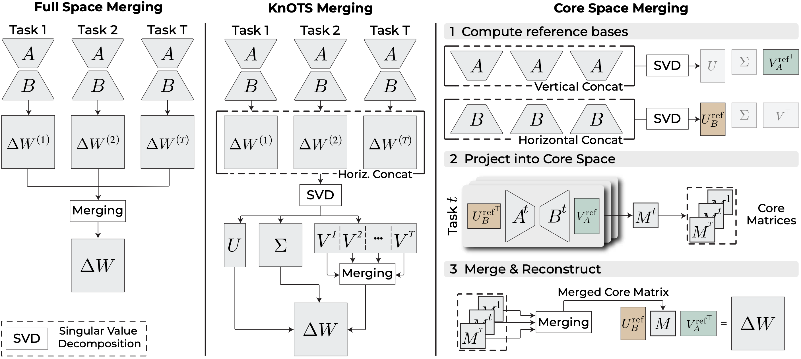

# Core Space Merging for Parameter-Efficient Fine-Tuning
[](https://arxiv.org/abs/2509.17786) [](https://github.com/apanariello4/core-space-merging/stargazers) [](#citation)

This repository contains the official implementation for the NeurIPS 2025 paper:

> **[Accurate and Efficient Low-Rank Model Merging in Core Space](https://arxiv.org/abs/2509.17786)**
> 
> [Aniello Panariello](https://scholar.google.com/citations?user=YnVl5pQAAAAJ)\*, [Daniel Marczak](https://scholar.google.com/citations?user=Vs4kBzQAAAAJ)\*, [Simone Magistri](https://scholar.google.com/citations?user=fAS993EAAAAJ), [Angelo Porrello](https://scholar.google.com/citations?user=pGNOOk0AAAAJ), [Bartłomiej Twardowski](https://scholar.google.com/citations?user=8yywECgAAAAJ), [Andrew D. Bagdanov](https://scholar.google.com/citations?user=_Fk4YUcAAAAJ), [Simone Calderara](https://scholar.google.com/citations?user=YaRuDkcAAAAJ), [Joost van de Weijer](https://scholar.google.com/citations?hl=en&user=Gsw2iUEAAAAJ)


---

## 🔍 Overview

Parameter-efficient fine-tuning (PEFT) methods such as LoRA and VeRA adapt large language and vision models with lightweight low-rank modules. However, combining multiple task-specific adapters is challenging due to mismatched subspaces.

We propose **Core Space Merging**, a theoretically grounded and empirically validated framework that:

- Aligns LoRA (or other PEFT) subspaces using reference bases computed via SVD.
- Yields **state-of-the-art** performance.
- Guarantees **no information loss** in the reconstruction.
- Seamlessly supports **heterogeneous ranks** across tasks.
- Generalizes beyond LoRA, e.g., to **VeRA**.

Experiments on ViT and Transformer models demonstrate superior per-task and averaged performance compared to existing baselines.



---

## 🚀 Getting Started

### Installation
```bash
git clone https://github.com/apanariello4/core-space-merging.git
cd core-space-merging
conda env create -f environment.yml
conda activate core-space-merging
```

### Checkpoints
We use checkpoints provided by [KnOTS](https://github.com/gstoica27/KnOTS). These are automatically downloaded from HuggingFace when running the scripts.

### Datasets
Most datasets being used should be downloaded automatically with `torchvision` or `huggingface`. For the datasets requiring manual preparation (like Cars, DTD, EuroSAT, SUN397), please follow the instructions in [this issue](https://github.com/mlfoundations/task_vectors/issues/1).

### Usage
As an example, to merge LoRA adapters using TSV in Core Space, run the following command:

```bash
python eval_scripts/8vision_pertask_linearsearch.py --config=vitB_r16_linearsearch_universal.py --merge_method=tsv --merge_space=core --representation=matrix_per_layer --isotropize=1
```

For more details on available options, please refer to the configuration files in the `configs` folder.

* Available merge methods:
  - `ta`: Task Arithmetic
  - `ties`: TRIM, ELECT SIGN & MERGE (TIES-Merging)
  - `dare`: Drops And REscales (DARE)
  - `dare-ties`: Dare + Ties
  - `tsv`: Task Singular Vector (TSV)
  - `cart`: Centered Arithmetic with Rank-reduced Task Vectors (CART)

* Available merge spaces:
  - `full`: Full space merging
  - `knots`: KnOTS space merging
  - `core`: Core space merging

### Citation

If you use this code in your research, please cite our paper:

```bibtex
@inproceedings{panariello2025efficient,
  title     = {Accurate and Efficient Low-Rank Model Merging in Core Space},
  author    = {Panariello, Aniello and Marczak, Daniel and Magistri, Simone and Porrello, Angelo and Twardowski, Bart{\l}omiej and Bagdanov, Andrew D. and Calderara, Simone and van de Weijer, Joost},
  booktitle = {Advances in Neural Information Processing Systems (NeurIPS)},
  year      = {2025}
}
```

### 🙏 Acknowledgements

This repository builds upon and was inspired by [KnOTS](https://github.com/gstoica27/KnOTS). We thank the authors for making their code available.
